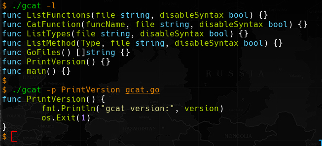

# GCAT: 



List or print functions, type, method in go files

## USAGE:

```
gcat [OPTION] FILE1 FILE2 ...

options:
-h, --help                     Show this help
-l, --list-functions           List all functions
-p, --print-function   FUNC    Cat FUNC function
-m, --method           TYPE    List TYPE method
-t, --list-types               List types
-d, --disable-syntax           Disable syntax highlighting
-v, --version                  Print version and exit
```

If no files  are passed, check recursivly in current directory  for .go files.


### Examples:

```sh
$ gcat --list-functions
$ gcat --print-function main main.go
```

## Install:

```sh
go install github.com/mmpx12/gcat@latest
```

or

```
git clone https://github.com/mmpx12/gcat.git
cd gcat
make
sudo make install
```

Prebuild binaries can be found  [here](https://github.com/mmpx12/gcat/releases/latest).
